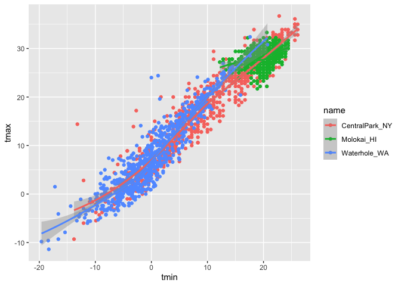

Exploratory analysis
================
2023-09-28

``` r
library(tidyverse)
```

    ## ── Attaching core tidyverse packages ──────────────────────── tidyverse 2.0.0 ──
    ## ✔ dplyr     1.1.3     ✔ readr     2.1.4
    ## ✔ forcats   1.0.0     ✔ stringr   1.5.0
    ## ✔ ggplot2   3.4.3     ✔ tibble    3.2.1
    ## ✔ lubridate 1.9.2     ✔ tidyr     1.3.0
    ## ✔ purrr     1.0.2     
    ## ── Conflicts ────────────────────────────────────────── tidyverse_conflicts() ──
    ## ✖ dplyr::filter() masks stats::filter()
    ## ✖ dplyr::lag()    masks stats::lag()
    ## ℹ Use the conflicted package (<http://conflicted.r-lib.org/>) to force all conflicts to become errors

``` r
library(ggridges)
```

``` r
weather_df = 
  rnoaa::meteo_pull_monitors(
    c("USW00094728", "USW00022534", "USS0023B17S"),
    var = c("PRCP", "TMIN", "TMAX"), 
    date_min = "2021-01-01",
    date_max = "2022-12-31") |>
  mutate(
    name = recode(
      id, 
      USW00094728 = "CentralPark_NY", 
      USW00022534 = "Molokai_HI",
      USS0023B17S = "Waterhole_WA"),
    tmin = tmin / 10,
    tmax = tmax / 10) |>
  select(name, id, everything())
```

    ## using cached file: /Users/dkoproski/Library/Caches/org.R-project.R/R/rnoaa/noaa_ghcnd/USW00094728.dly

    ## date created (size, mb): 2023-09-28 10:18:49.741945 (8.524)

    ## file min/max dates: 1869-01-01 / 2023-09-30

    ## using cached file: /Users/dkoproski/Library/Caches/org.R-project.R/R/rnoaa/noaa_ghcnd/USW00022534.dly

    ## date created (size, mb): 2023-09-28 10:18:55.051919 (3.83)

    ## file min/max dates: 1949-10-01 / 2023-09-30

    ## using cached file: /Users/dkoproski/Library/Caches/org.R-project.R/R/rnoaa/noaa_ghcnd/USS0023B17S.dly

    ## date created (size, mb): 2023-09-28 10:18:57.082958 (0.994)

    ## file min/max dates: 1999-09-01 / 2023-09-30

``` r
weather_df
```

    ## # A tibble: 2,190 × 6
    ##    name           id          date        prcp  tmax  tmin
    ##    <chr>          <chr>       <date>     <dbl> <dbl> <dbl>
    ##  1 CentralPark_NY USW00094728 2021-01-01   157   4.4   0.6
    ##  2 CentralPark_NY USW00094728 2021-01-02    13  10.6   2.2
    ##  3 CentralPark_NY USW00094728 2021-01-03    56   3.3   1.1
    ##  4 CentralPark_NY USW00094728 2021-01-04     5   6.1   1.7
    ##  5 CentralPark_NY USW00094728 2021-01-05     0   5.6   2.2
    ##  6 CentralPark_NY USW00094728 2021-01-06     0   5     1.1
    ##  7 CentralPark_NY USW00094728 2021-01-07     0   5    -1  
    ##  8 CentralPark_NY USW00094728 2021-01-08     0   2.8  -2.7
    ##  9 CentralPark_NY USW00094728 2021-01-09     0   2.8  -4.3
    ## 10 CentralPark_NY USW00094728 2021-01-10     0   5    -1.6
    ## # ℹ 2,180 more rows

``` r
ggplot(weather_df, aes(x = tmin, y = tmax)) +
  geom_point()
```

    ## Warning: Removed 17 rows containing missing values (`geom_point()`).

<!-- -->

``` r
weather_df |> 
  ggplot(aes(x=tmin,y=tmax)) + 
  geom_point()
```

    ## Warning: Removed 17 rows containing missing values (`geom_point()`).

<!-- -->

``` r
ggplot(weather_df, aes(x = tmin, y = tmax, color = name)) +
  geom_point(aes(color = name)) +
  geom_smooth()
```

    ## `geom_smooth()` using method = 'loess' and formula = 'y ~ x'

    ## Warning: Removed 17 rows containing non-finite values (`stat_smooth()`).

    ## Warning: Removed 17 rows containing missing values (`geom_point()`).

<!-- -->

``` r
ggplot(weather_df, aes(x = tmin, y = tmax)) +
  geom_point(aes(color = name), alpha = 0.3) +
  geom_smooth(se = FALSE)
```

    ## `geom_smooth()` using method = 'gam' and formula = 'y ~ s(x, bs = "cs")'

    ## Warning: Removed 17 rows containing non-finite values (`stat_smooth()`).

    ## Warning: Removed 17 rows containing missing values (`geom_point()`).

<!-- -->

``` r
ggplot(weather_df, aes(x = tmin, y = tmax, color = name)) +
  geom_point(aes(alpha = 0.3)) +
  geom_smooth() +
  facet_grid(. ~ name)
```

    ## `geom_smooth()` using method = 'loess' and formula = 'y ~ x'

    ## Warning: Removed 17 rows containing non-finite values (`stat_smooth()`).

    ## Warning: Removed 17 rows containing missing values (`geom_point()`).

<!-- -->

``` r
ggplot(weather_df, aes(x = date, y = tmax, color = name)) +
  geom_point(aes(size = prcp), alpha = .3) +
  geom_smooth() +
  facet_grid(. ~ name)
```

    ## `geom_smooth()` using method = 'loess' and formula = 'y ~ x'

    ## Warning: Removed 17 rows containing non-finite values (`stat_smooth()`).

    ## Warning: Removed 19 rows containing missing values (`geom_point()`).

<!-- -->

``` r
weather_df |> 
  ggplot(aes(x = tmin, y = tmax)) +
  geom_hex()
```

    ## Warning: Removed 17 rows containing non-finite values (`stat_binhex()`).

<!-- -->

``` r
ggplot(weather_df, aes(x = tmax, fill = name)) +
  geom_density(alpha=0.3)
```

    ## Warning: Removed 17 rows containing non-finite values (`stat_density()`).

<!-- -->

``` r
ggplot(weather_df, aes(y = tmax, x = name)) +
  geom_boxplot()
```

    ## Warning: Removed 17 rows containing non-finite values (`stat_boxplot()`).

<!-- -->

``` r
ggplot(weather_df, aes(y = tmax, x = name)) +
  geom_violin()
```

    ## Warning: Removed 17 rows containing non-finite values (`stat_ydensity()`).

<!-- -->

``` r
ggplot(weather_df, aes(x = tmax, y = name)) +
  geom_density_ridges()
```

    ## Picking joint bandwidth of 1.54

    ## Warning: Removed 17 rows containing non-finite values
    ## (`stat_density_ridges()`).

<!-- -->

``` r
ggplot(weather_df, aes(x = tmin, y = tmax, color = name)) +
  geom_point(aes(color = name), alpha = 0.3) +
  geom_bin_2d(aes(color = "red"), alpha = 0.3) +
  geom_violin(aes(color = "blue"), fill = "yellow") +
  geom_hex(fill = "brown") +
  geom_smooth(aes(size = prcp)) +
  geom_abline() +
  geom_path() +
  geom_boxplot() +
  geom_jitter() +
  geom_rug() +
  geom_function() +
  geom_step() +
  stat_smooth() +
  geom_polygon() +
  geom_line() +
  geom_raster() +
  geom_tile() +
  ggtitle("My Graph")
```

    ## Warning: Using `size` aesthetic for lines was deprecated in ggplot2 3.4.0.
    ## ℹ Please use `linewidth` instead.
    ## This warning is displayed once every 8 hours.
    ## Call `lifecycle::last_lifecycle_warnings()` to see where this warning was
    ## generated.

    ## Warning: Removed 17 rows containing non-finite values (`stat_bin2d()`).

    ## Warning: Removed 17 rows containing non-finite values (`stat_ydensity()`).

    ## Warning: Removed 17 rows containing non-finite values (`stat_binhex()`).

    ## `geom_smooth()` using method = 'loess' and formula = 'y ~ x'

    ## Warning: Removed 17 rows containing non-finite values (`stat_smooth()`).

    ## Warning: The following aesthetics were dropped during statistical transformation: size
    ## ℹ This can happen when ggplot fails to infer the correct grouping structure in
    ##   the data.
    ## ℹ Did you forget to specify a `group` aesthetic or to convert a numerical
    ##   variable into a factor?

    ## Warning: Removed 17 rows containing missing values (`stat_boxplot()`).

    ## Warning: Computation failed in `stat_function()`
    ## Caused by error in `compute_group()`:
    ## ! argument "fun" is missing, with no default

    ## `geom_smooth()` using method = 'loess' and formula = 'y ~ x'

    ## Warning: Removed 17 rows containing non-finite values (`stat_smooth()`).

    ## Warning: Raster pixels are placed at uneven horizontal intervals and will be shifted
    ## ℹ Consider using `geom_tile()` instead.
    ## Raster pixels are placed at uneven horizontal intervals and will be shifted
    ## ℹ Consider using `geom_tile()` instead.

    ## Warning: Removed 17 rows containing missing values (`geom_point()`).

    ## Warning: Removed 1 row containing missing values (`geom_path()`).

    ## Warning: Removed 17 rows containing missing values (`geom_point()`).

    ## Warning: Removed 1 row containing missing values (`geom_step()`).

    ## Warning: Removed 17 rows containing missing values (`geom_line()`).

    ## Warning: Removed 17 rows containing missing values (`geom_raster()`).

    ## Warning: Removed 17 rows containing missing values (`geom_tile()`).

<!-- -->
